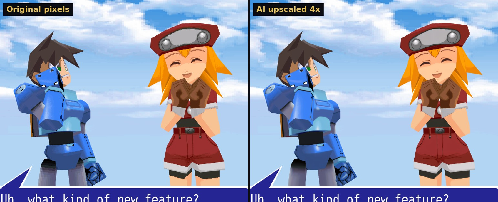
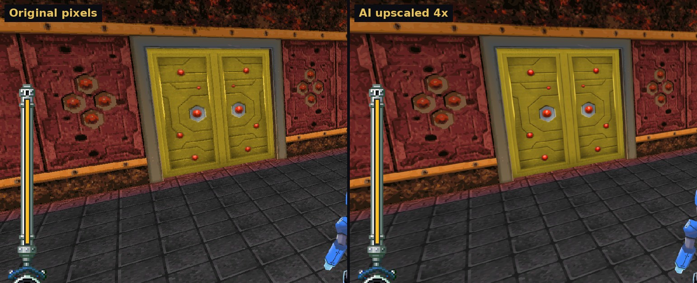
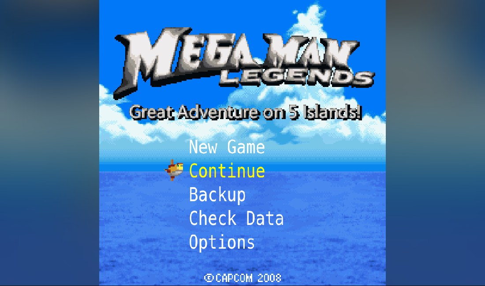
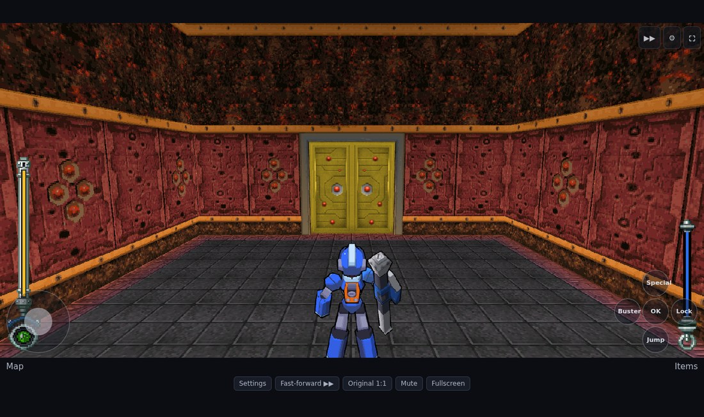
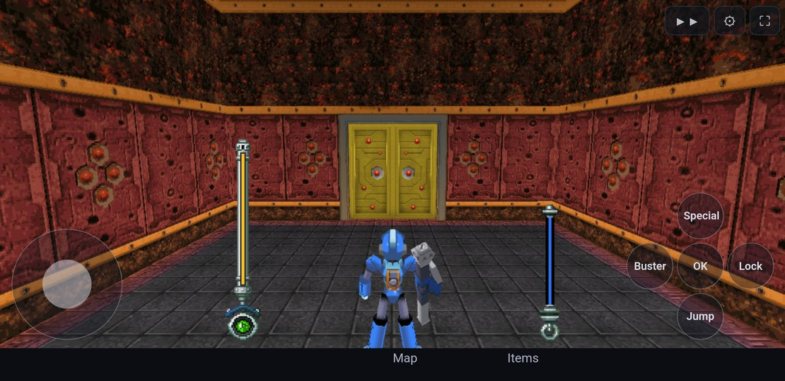

# Rockman DASH: Great Adventure on 5 Islands — in your browser

A 2008 Japanese mobile-phone game from the Mega Man Legends series, running as a web page, with
optional modern upgrades: widescreen, 60 fps, controller support, cel shading and more.


**[Watch the trailer on YouTube](https://www.youtube.com/watch?v=xwdUlAmF_zo)** (52 seconds)

> **This project is fully vibe coded.** Every line was written by an AI coding agent (Claude
> Code) working from plain-English requests. There is no support and no roadmap: don't bother me
> with issues — **fork it and do whatever you want with it.**

## Quick start (Linux)

1. Put your own copy of the game's files in the `gamefiles` folder (zips are fine).
2. Run `./setup_script.sh`. It checks your tools, sorts the files, builds the game and opens it.
3. Next time, run `./play.sh`.
4. Optional: `./package_html.sh` packs the whole game into one HTML file you can copy to any
   device or archive, and open straight in a browser.
5. Optional: `./package_android.sh` builds an Android app (`.apk`) for phones and Android
   handhelds such as the AYN Thor or Retroid Pocket.

**[The easy setup guide](easy_setup_guide.md)** walks through it step by step.

## What is this, in plain words?

*Rockman DASH: Great Adventure on 5 Islands* was a 3D action game Capcom released in 2008 for
NTT DoCoMo phones in Japan. It could only be played on those phones, its download server is long
gone, and the usual way to play it today is a phone emulator that doesn't run it well. A fan
English patch exists (see [Getting the game](#getting-the-game)).

This project has three goals:

1. **Keep the game playable.** Open a web page, play the game. No emulator, nothing to install
   for the player.
2. **Make it nicer to play than it was on a phone.** The original ran in a 240×240 window at
   15 frames per second with tank controls on a number pad. Everything in the
   [feature list](#what-the-port-adds) is optional: switch it all off and you get the phone
   picture, pixel for pixel.
3. **Show how a game like this can be ported without rewriting it.** The game's own program code
   is translated automatically into JavaScript, and the phone's built-in functions (drawing,
   3D, sound, buttons, storage) are re-created on top of the browser. See
   [How it works](#how-it-works).

### Before and after

| The phone's picture (240×240) | The same spot with the upgrades on |
|---|---|
|  |  |

## What the port adds

All of these are options in the settings menu (press **F1**, the ⚙ button, or both sticks on a
controller); none change the game's rules, and with everything off you get the phone's picture.

**Picture**

- **Widescreen** — the 3D view fills the window and the life and weapon gauges move to the screen
  edges. Screens that stay square (title, menus, map) get a blurred copy of the picture in the
  side bars instead of black.
- **High resolution** — sharp at any window size, or the original 240p if you prefer.
- **30 / 60 fps** — the game still thinks 15 times a second (every speed and timer in it is
  counted that way), so the in-between pictures are interpolated, the same way other recompiled
  console ports do it. Camera, objects and character animation are all smoothed.
- **Texture filtering** — original sharp pixels, smooth, an upscaled "HD" mode, or an optional
  AI-upscaled texture pack you generate yourself (`tools/ai/textures.py`, needs a ComfyUI server);
  the pack covers the Legends 2 models' textures too.
- **Cel shading, lighting and shadows** — the original has no lighting at all.
- **Field of view** and **camera distance** sliders.

**Controls**

- **Free camera** — look around with the right stick, by dragging the mouse, or with the mouse
  captured (move to look, left button fires, right button locks on). Sensitivity and invert
  options.
- **Dual-stick controls** — the left stick moves you where you push it, relative to the camera,
  at the speed you push; the right stick looks around. The same is available for WASD with mouse
  look. The game's original turn-and-walk tank controls are one switch away.
- **Controller support** with rumble, and **rebindable** keyboard and controller buttons.
- **Touch controls** — an on-screen stick and buttons, and swipe to look; they step aside
  while a controller is connected.
- **Fast-forward** for dialogue and cutscenes: a button under the game, or hold Tab / L3.

**Sound**

- **Sampled instruments** for the music, and separate music / effects volume.

**Extras**

- **Fast loading** — seconds instead of half a minute per area.
- **Save export / import** — saves live in your browser; back them up or move them as a file.
- **Save states** — Save and Load buttons (under the game, and in the toolbar on touch screens)
  freeze the exact moment during a mission and bring it back, enemies and all. One state, kept
  until you close the game.
- **Cheats** — infinite life, infinite weapon energy, one-hit kills, max zenny, game speed.
- **Mega Man Legends 2 character models** — if you own that game's disc, its models can stand in
  for the phone's (see [below](#optional-legends-2-character-models)).
- A small toolbar over the game in fullscreen, so settings and fast-forward stay in reach.
- **Take it anywhere** — one script packs the game into a single HTML file, another into an
  Android app; both play offline.

| Cutscene with Legends 2 models and cel shading | Settings menu |
|---|---|
|  |  |

Optional AI-upscaled textures (left: the original pixels, right: the texture pack):




| Title screen in widescreen, with blurred side bars | Touch controls |
|---|---|
|  |  |

## Take it with you

Once the game is set up on a Linux machine, two scripts turn it into something you can carry to
other devices. Both play offline, and both contain your game files, so they are for your own use.

| Script | What it makes | Use it for |
|---|---|---|
| `./package_html.sh` | One HTML file (about 40 MB; `--small` 13 MB, `--full` 140 MB) | Any computer or a Steam Deck: copy the file, open it in a browser. Good for archiving. |
| `./package_android.sh` | An Android app, `.apk` (about 27 MB; `--small` 6 MB, `--full` 100 MB) | Phones and Android handhelds (AYN Thor, Retroid Pocket …). Full screen, landscape, uses the built-in or a Bluetooth controller, with on-screen controls when there is none. Android 8 or newer. |



## Getting the game

**This repository does not contain the game.** You need your own copy of the game's files, and
the port will not build or run without them. For the story of how the game was recovered and
translated into English, and for credit to the people who did that, see Rockman Corner:
<https://www.rockman-corner.com/2025/03/rockman-dash-great-adventure-on-5.html>

The simple way is to drop everything into `gamefiles/` and let `./setup_script.sh` sort it
(see the [easy setup guide](easy_setup_guide.md)). By hand, the files go here (the two variants
are the two flavours of the English patch):

```
original/
  localized/     RockmanDASH.jar  RockmanDASH.jam  RockmanDASH.sp    (MegaMan, Servbot, Reaverbot…)
  delocalized/   RockmanDASH.jar  RockmanDASH.jam  RockmanDASH.sp    (Rock, Kobun, Reaverd…)
  sdcard/        RDDATA0.BIN … RDDATA4.BIN, RDDATA00.BIN … RDDATA44.BIN   (island data)
```

## Building and running

`./setup_script.sh` does all of this for you on Linux; these are the manual steps.

You need a JDK (11 or newer), Node.js (18 or newer) and Python 3. Optional: a General MIDI SoundFont at
`/usr/share/sounds/sf2/FluidR3_GM.sf2` (Debian/Ubuntu package `fluid-soundfont-gm`) — if it is
there, the build cuts the instruments the music uses out of it and the music plays with recorded
instruments instead of simple synthesis.

```bash
tools/build.sh              # translate the game to JavaScript and copy its data (both variants)
cd web && npm install
npm run dev                 # then open http://localhost:5173/
```

Pick a variant on the start page. "Continue" loads the save that is in the scratchpad file you
supplied; "New Game" starts from the beginning. `npm run build` in `web/` produces a static site
in `web/dist/` that any web server can host (remember that it then contains your game files).

## Controls

Everything here can be changed under Settings > Controls.

| Action | Keyboard | Controller |
|---|---|---|
| Move / turn | Arrows or WASD | Left stick or D-pad; L1 / R1 turn |
| Look around | Drag the mouse (or capture it: Settings > Controls); R re-centres | Right stick; R3 re-centres |
| Jump | Space or X | A / Cross |
| Buster | Z or J | X / Square |
| Special weapon | C or K | Y / Triangle |
| Lock-on | Shift, V or L | L2 / R2 |
| Confirm | Enter | A / Cross or B / Circle |
| Map / Back, Items (the labels under the game; also clickable) | Q, E | Select, Start |
| Fast-forward (hold; or click the button under the game) | Tab | L3 |
| Settings menu | F1 | Press both sticks in (then D-pad, A, B, L1 / R1) |

F2 original resolution, F3 widescreen, F4 cheats, M mute, F fullscreen.

A controller is dual-stick by default: left stick moves relative to the camera, right stick
looks. "Camera-relative keys" (Settings > Controls) does the same for the movement keys. With the mouse captured, the left button fires the
buster and the right button locks on. On a phone or tablet, an on-screen stick and buttons appear
over the game, and dragging a finger on the picture looks around.

## How it works

```
the game's .jar (Java bytecode) ──┐
our re-creation of the phone's    ├─ TeaVM ──►  one JavaScript file
programming interface (Java)   ───┘                    │ calls
                              the "host": three.js renderer, 2D canvas,
                              input, storage, sound  ◄──┘
```

- The game was written in Java for phones (DoJa 5). Its compiled code is **statically
  recompiled** to JavaScript ahead of time with [TeaVM](https://teavm.org/). The game's logic is
  not rewritten and nothing is interpreted while you play.
- The phone functions the game calls (`com.nttdocomo.*`) are re-implemented in `runtime/` and
  `web/src/host/`: 2D drawing on a canvas, the phone's 3D engine on
  [three.js](https://threejs.org/), sound on a small synthesiser, saves in the browser's storage.
- The game's file formats (maps, models, animations, music) are parsed directly; the parsers are
  in `web/src/formats/` and documented in their headers.
- The upgrades hook in at the edges: a camera class replaced from decompiled source, three
  single method calls redirected at build time, and the renderer recording each game frame so it
  can be replayed in between.

[`CLAUDE.md`](CLAUDE.md) is the detailed technical document: layout, formats, engine conventions
and the current status. It is written for the AI agent that maintains the code, which also makes
it the most complete description of the project.

## What is where

| Path | What |
|---|---|
| `original/` | Your game files (not in the repository) |
| `runtime/` | The phone's programming interface re-created in Java, and the TeaVM build |
| `web/` | The web page: renderer, input, sound, storage (`src/host/`), file-format parsers (`src/formats/`), optional asset swaps (`src/mods/`) |
| `setup_script.sh`, `play.sh` | One-step setup for Linux, and the command to start the game afterwards |
| `package_html.sh` | Packs the built game into one self-contained HTML file |
| `package_android.sh` | Builds an Android app (`.apk`) of the game |
| `gamefiles/` | Where you drop your game files for the setup script (never committed) |
| `tools/` | Build script, jar patcher, test driver and video recorder, format dump tools, SoundFont and Legends 2 extractors, AI texture and music helpers, trailer scripts |
| `docs/` | The pictures on this page |
| `CLAUDE.md` | The full technical notes |

## Optional: Legends 2 character models

If you have a disc image of *Mega Man Legends 2* (PlayStation), `tools/mml2/` can extract its
character models and the port will pose them with the phone game's own animation. Nothing from
that disc is in this repository either; the commands are in `CLAUDE.md` under "Commands". Without
it the phone's own models are used, and everything else works the same.

## Status

Both English variants boot, load and save, and the areas, cutscenes, menus, shops and travel
between islands tried so far all work. Nobody has played it from start to finish in this port
yet. Known rough edges:

- The music is played with General MIDI instruments (sampled if you have the SoundFont,
  synthesised otherwise), not the phone's own sound source, so it does not sound like the phone.
- Above 15 fps, the 2D layer (HUD, dialogue) still updates 15 times a second.
- The Android app has been run on a Retroid Pocket 3+ (full speed, built-in controller
  detected) and in an emulator. Devices with an old built-in web engine, the Pocket 3+
  included, need "Android System WebView" updated from the Play Store first; the easy setup
  guide says how. Other handhelds are untested.
- Most options were checked with screenshots and automated runs rather than long play sessions.
  Touch controls and mouse capture have only been tried with simulated input, not on real
  devices, and nobody has yet judged the music by ear.

## Credits and legal

- *Rockman DASH: Great Adventure on 5 Islands* and *Mega Man Legends* are © Capcom. This is an
  unofficial fan project, not affiliated with or endorsed by Capcom.
- The game's recovery and English translation are the work of the fans credited in the Rockman
  Corner article linked above.
- No game data, art, music or disc contents are included here. The pictures on this page are
  screenshots of the port running a user-supplied copy.
- Built on [TeaVM](https://teavm.org/), [three.js](https://threejs.org/) and
  [fflate](https://github.com/101arrowz/fflate). The optional sampled instruments come from the
  FluidR3 GM SoundFont by Frank Wen (MIT licence), which is not included either.
- There is no licence file and no strings attached to the port's own code: as it says at the top,
  fork it and do what you want.
