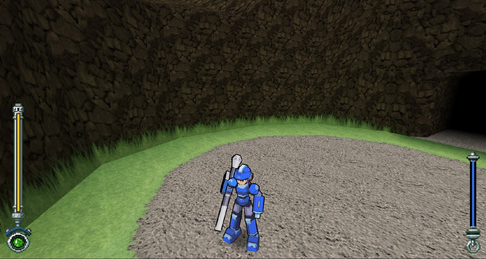
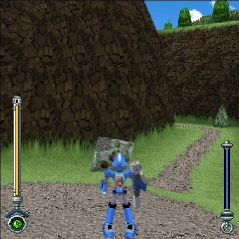
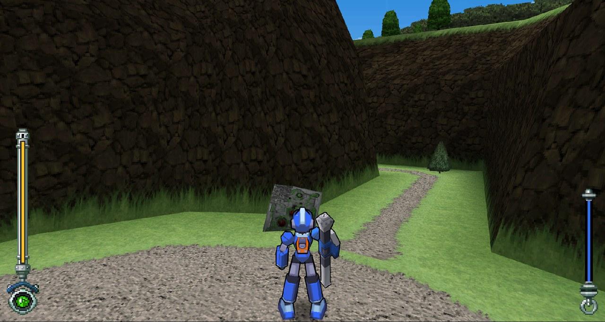
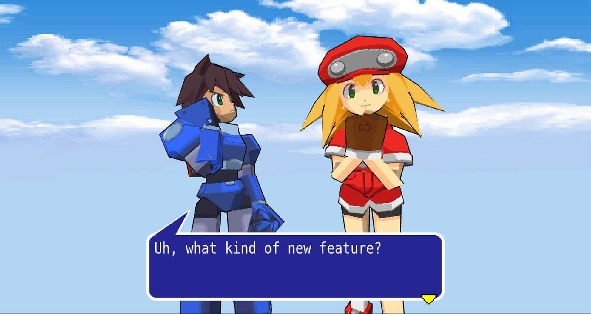
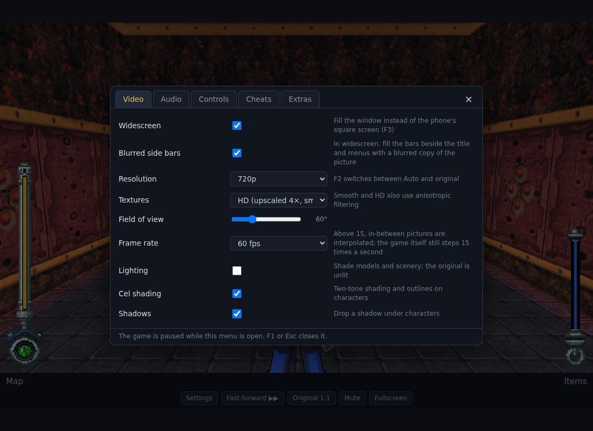

# Rockman DASH: Great Adventure on 5 Islands — in your browser

A 2008 Japanese mobile-phone game from the Mega Man Legends series, running as a web page, with
optional modern upgrades: widescreen, 60 fps, controller support, cel shading and more.



> **This project is fully vibe coded.** Every line was written by an AI coding agent (Claude
> Code) working from plain-English requests. There is no support and no roadmap: don't bother me
> with issues — **fork it and do whatever you want with it.**

## What is this, in plain words?

*Rockman DASH: Great Adventure on 5 Islands* was a 3D action game Capcom released in 2008 for
NTT DoCoMo phones in Japan. It could only be played on those phones, its download server is long
gone, and the usual way to play it today is a phone emulator that doesn't run it well. A fan
English patch exists (see [Getting the game](#getting-the-game)).

This project has three goals:

1. **Keep the game playable.** Open a web page, play the game. No emulator, nothing to install
   for the player.
2. **Make it nicer to play than it was on a phone.** The original ran in a 240×240 window at
   15 frames per second with tank controls on a number pad. Everything in the
   [feature list](#what-the-port-adds) is optional: switch it all off and you get the phone
   picture, pixel for pixel.
3. **Show how a game like this can be ported without rewriting it.** The game's own program code
   is translated automatically into JavaScript, and the phone's built-in functions (drawing,
   3D, sound, buttons, storage) are re-created on top of the browser. See
   [How it works](#how-it-works).

### Before and after

| The phone's picture (240×240) | The same spot with the upgrades on |
|---|---|
|  |  |

## What the port adds

All of these are options in the settings menu (press **F1**); none change the game's rules.

- **Widescreen** — the 3D view fills the window; the life and weapon gauges move to the screen
  edges.
- **High resolution** — sharp at any window size, or the original 240p if you prefer.
- **30 / 60 fps** — the game still thinks 15 times a second (every speed and timer in it is
  counted that way), so the in-between pictures are interpolated, the same way other recompiled
  console ports do it.
- **Free camera** — look around with the right stick or by dragging the mouse.
- **Controller support** with rumble, and **rebindable** keyboard and controller buttons.
- **Direct stick movement** — push the stick where you want to go, instead of turn-and-walk
  tank controls.
- **Cel shading, lighting and shadows** — the original has no lighting at all.
- **Fast-forward** for dialogue and cutscenes, and **fast loading** (seconds instead of half a
  minute per area).
- **Sampled music instruments** and separate music / effects volume.
- **Cheats** — infinite life, infinite weapon energy, max zenny, game speed.
- **Mega Man Legends 2 character models** — if you own that game's disc, its models can stand in
  for the phone's (see [below](#optional-legends-2-character-models)).
- Saves are kept in your browser.

| Cutscene with Legends 2 models and cel shading | Settings menu |
|---|---|
|  |  |

## Getting the game

**This repository does not contain the game.** You need your own copy of the game's files, and
the port will not build or run without them. For the story of how the game was recovered and
translated into English, and for credit to the people who did that, see Rockman Corner:
<https://www.rockman-corner.com/2025/03/rockman-dash-great-adventure-on-5.html>

Put the files here (the two variants are the two flavours of the English patch):

```
original/
  localized/     RockmanDASH.jar  RockmanDASH.jam  RockmanDASH.sp    (MegaMan, Servbot, Reaverbot…)
  delocalized/   RockmanDASH.jar  RockmanDASH.jam  RockmanDASH.sp    (Rock, Kobun, Reaverd…)
  sdcard/        RDDATA0.BIN … RDDATA4.BIN, RDDATA00.BIN … RDDATA44.BIN   (island data)
```

## Building and running

You need a JDK (11 or newer), Node.js and Python 3. Optional: a General MIDI SoundFont at
`/usr/share/sounds/sf2/FluidR3_GM.sf2` (Debian/Ubuntu package `fluid-soundfont-gm`) — if it is
there, the build cuts the instruments the music uses out of it and the music plays with recorded
instruments instead of simple synthesis.

```bash
tools/build.sh              # translate the game to JavaScript and copy its data (both variants)
cd web && npm install
npm run dev                 # then open http://localhost:5173/
```

Pick a variant on the start page. "Continue" loads the save that is in the scratchpad file you
supplied; "New Game" starts from the beginning.

## Controls

Everything here can be changed under Settings > Controls.

| Action | Keyboard | Controller |
|---|---|---|
| Move / turn | Arrows or WASD | Left stick or D-pad; L1 / R1 turn |
| Look around | Drag the mouse; R re-centres | Right stick; R3 re-centres |
| Jump | Space or X | A / Cross |
| Buster | Z or J | X / Square |
| Special weapon | C or K | Y / Triangle |
| Lock-on | Shift, V or L | L2 / R2 |
| Confirm | Enter | A / Cross or B / Circle |
| Map / Back, Items | Q, E | Select, Start |
| Fast-forward (hold) | Tab | L3 |
| Settings | F1 | — |

F2 original resolution, F3 widescreen, F4 cheats, M mute, F fullscreen.

## How it works

```
the game's .jar (Java bytecode) ──┐
our re-creation of the phone's    ├─ TeaVM ──►  one JavaScript file
programming interface (Java)   ───┘                    │ calls
                              the "host": three.js renderer, 2D canvas,
                              input, storage, sound  ◄──┘
```

- The game was written in Java for phones (DoJa 5). Its compiled code is **statically
  recompiled** to JavaScript ahead of time with [TeaVM](https://teavm.org/). The game's logic is
  not rewritten and nothing is interpreted while you play.
- The phone functions the game calls (`com.nttdocomo.*`) are re-implemented in `runtime/` and
  `web/src/host/`: 2D drawing on a canvas, the phone's 3D engine on
  [three.js](https://threejs.org/), sound on a small synthesiser, saves in the browser's storage.
- The game's file formats (maps, models, animations, music) are parsed directly; the parsers are
  in `web/src/formats/` and documented in their headers.
- The upgrades hook in at the edges: a camera class replaced from decompiled source, three
  single method calls redirected at build time, and the renderer recording each game frame so it
  can be replayed in between.

[`CLAUDE.md`](CLAUDE.md) is the detailed technical document: layout, formats, engine conventions
and the current status. It is written for the AI agent that maintains the code, which also makes
it the most complete description of the project.

## Optional: Legends 2 character models

If you have a disc image of *Mega Man Legends 2* (PlayStation), `tools/mml2/` can extract its
character models and the port will pose them with the phone game's own animation. Nothing from
that disc is in this repository either; the commands are in `CLAUDE.md` under "Commands". Without
it the phone's own models are used, and everything else works the same.

## Status

Playable from the title screen through the missions, with saving, in both English variants. Known
rough edges:

- The music is played with General MIDI instruments (sampled if you have the SoundFont,
  synthesised otherwise), not the phone's own sound source, so it does not sound like the phone.
- Above 15 fps, Legends 2 model animation and the 2D layer still update 15 times a second.
- The settings menu cannot be driven from a controller.
- The newer options were checked with screenshots and automated runs rather than long play
  sessions.

## Credits and legal

- *Rockman DASH: Great Adventure on 5 Islands* and *Mega Man Legends* are © Capcom. This is an
  unofficial fan project, not affiliated with or endorsed by Capcom.
- The game's recovery and English translation are the work of the fans credited in the Rockman
  Corner article linked above.
- No game data, art, music or disc contents are included here. The pictures on this page are
  screenshots of the port running a user-supplied copy.
